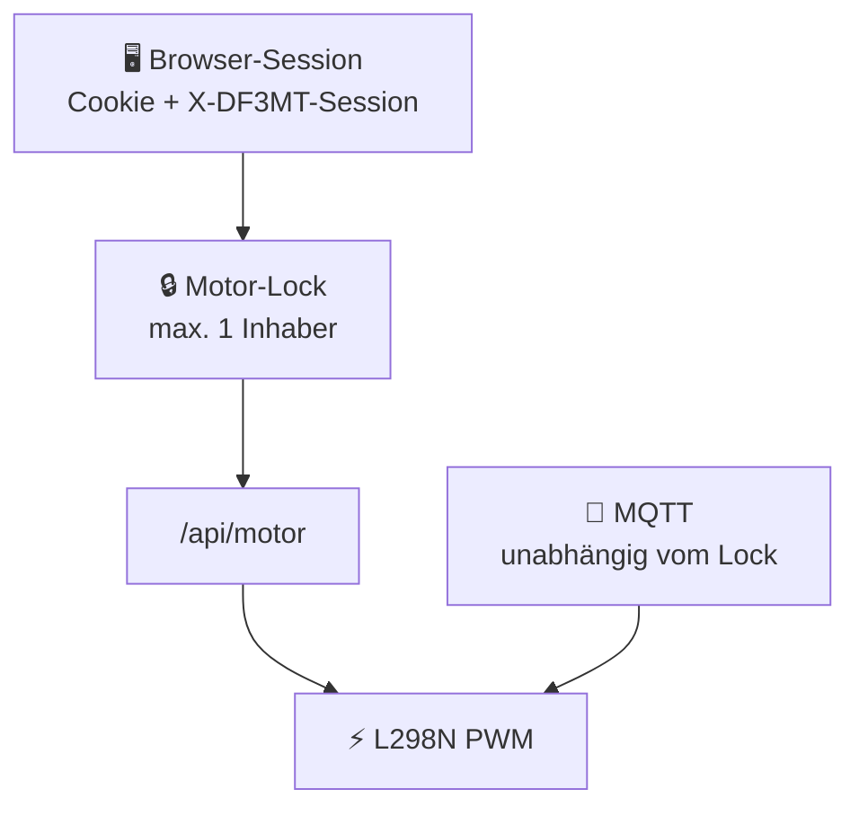

<div align="center">

# 🛠️ DF3MT-Rotor (ESP32)

### Firmware für den DF3MT Portable Rotor

[](https://github.com/DF3MT/DF3MT-Portable-Antenna-Wifi-Rotor/releases/latest)
[](https://www.espressif.com/)
[](https://www.gnu.org/licenses/gpl-3.0)

**SoftAP + STA** · **Web-UI** · **L298N-PWM** · **MQTT / Home Assistant** · **OTA**

[⬆️ Firmware-Übersicht](../README.md) · [🏠 Projekt-Root](../../README.md) · [🌐 df3mt.de](https://df3mt.de)

</div>

---

## 📌 Überblick

Im Repository liegt dieser Sketch unter **`Firmware/DF3MT-Rotor/`**.

> 💡 In der Arduino IDE **diesen Ordner** öffnen — nicht nur die `.ino` aus einem anderen Pfad.

| Baustein | Rolle |
|:--|:--|
| 📄 `DF3MT-Rotor.ino` | Hauptsketch (WiFi, Motor, MQTT, OTA, HTTP) |
| ⚙️ `DF3MT_Config.h` | GPIO, AP, MQTT-Defaults, UI-Rampen, OTA |
| 🌐 `kIndexHtml.h` | Eingebettete Web-UI (PROGMEM, ohne SPIFFS) |

---

## 🔨 Build

| | Einstellung |
|:-:|:--|
| 🧰 | **Arduino IDE** + Board-Paket *esp32* (Arduino-ESP32 **3.x**) |
| 📦 | Partition Scheme **mit OTA** |
| 🔌 | Serial-Log: **`115200`** Baud (`DF3MT_SERIAL_BAUD`) |
| 📨 | Bibliothek **PubSubClient** |

```text
Sketch-Dateien in diesem Ordner:
├── DF3MT-Rotor.ino
├── DF3MT_Config.h
└── kIndexHtml.h
```

---

## ⚙️ Konfiguration (`DF3MT_Config.h`)

Wichtige Schalter: GPIO (`DF3MT_L298N_*`), AP-SSID/Passwort, STA-Hostname, HTTP-Port, MQTT-Defaults, UI-Rampenzeiten, OTA.

### 🔐 Geheimnisse nicht ins öffentliche Repository

`DF3MT_AP_PASS`, WLAN-/MQTT-Zugangsdaten in der Web-UI (NVS) und ggf. `#define DF3MT_OTA_PASSWORD` sind **sensible Daten**.

| ✅ Empfohlen | ❌ Vermeiden |
|:--|:--|
| Passwörter nur über die **Web-UI → NVS** setzen | Echte Passwörter in der geteilten `DF3MT_Config.h` committen |
| Lokale `secrets.h` / `DF3MT_Secrets.h` (stehen in `.gitignore`) | Secrets in Issues / Screenshots posten |

> 🛡️ Vor jedem Push prüfen: keine echten Passwörter in der öffentlichen Config.

### 🏷️ Router-Name (STA) vs. mDNS (OTA)

| Einstellung | Zweck | Beispiel |
|:--|:--|:--|
| 📶 **`DF3MT_WIFI_STA_HOSTNAME`** | DHCP-Clientname im **Heim-WLAN** (Router-Geräteliste) | `DF3MT-Rotor` |
| 📡 **`DF3MT_OTA_HOSTNAME`** | **mDNS** für Arduino-IDE-OTA (`*.local`) | `df3mt-rotor` |

Beide bewusst getrennt halten — Details stehen auch als Kommentar in `DF3MT_Config.h`.

---

## 🔒 Web-UI: Motor-Lock vs. MQTT



- 🖥️ **Browser-Steuerung** nutzt eine Sitzungs-ID (Cookie `df3mt_motor_sid` + Header `X-DF3MT-Session`). Pro ESP ist **maximal eine** Sitzung Lock-Inhaber für `/api/motor`.
- 📨 **MQTT**-Befehle sind **unabhängig** vom Web-Lock — ideal für Home Assistant, auch wenn die Webseite offen ist.
- 🚫 Ungültige MQTT-Payloads werden **ignoriert** und im Seriallog als Warnung vermerkt.

---

## 🏠 MQTT / Home Assistant (Auto-Discovery)

Alle Topics liegen unter dem in der Web-UI eingestellten `{prefix}` (Default **`df3mt/rotor`**).

Beim Verbinden meldet sich die Firmware per **MQTT-Discovery** und legt u. a. an:

| Entity (HA) | Typ | Command | State | Werte |
|:--|:--|:--|:--|:--|
| 🎚️ PWM (signed) | `number` | `{prefix}/set` | `{prefix}/state` | −255…255 (0 = Stopp, + CW, − CCW) |
| 💨 Speed | `number` | `{prefix}/speed/set` | `{prefix}/speed/state` | 0…255 (Magnitude) |
| 🧭 Direction | `select` | `{prefix}/direction/set` | `{prefix}/direction/state` | `STOP` / `CW` / `CCW` |
| 🔄 Rotate CW | `button` | `{prefix}/cw/set` | – | Press → CW mit aktueller Speed |
| ↺ Rotate CCW | `button` | `{prefix}/ccw/set` | – | Press → CCW mit aktueller Speed |
| ⏹️ Stop | `button` | `{prefix}/stop/set` | – | Press → `STOP` |
| ▶️ Running | `binary_sensor` | – | `{prefix}/running/state` | `ON` / `OFF` |
| 🔗 Web URL | `sensor` | – | `{prefix}/url/state` | z. B. `http://192.168.4.1` |

**Hinweise:**

- 🔗 **Speed** + **Direction** = derselbe Sollwert wie *PWM (signed)* (`PWM = Richtung × Speed`). Beim Stoppen bleibt der Speed gemerkt.
- 🔄 Web-UI, `{prefix}/set` und Speed/Direction bleiben **synchron** (State-Topics retained).
- 📶 Verfügbarkeit: `{prefix}/availability` → `online` / `offline` (MQTT-LWT).

### 📦 Fertige HA-Dateien

| | Datei |
|:-:|:--|
| 📦 | [`homeassistant/packages/df3mt_rotor.yaml`](../../homeassistant/packages/df3mt_rotor.yaml) |
| 📊 | [`homeassistant/lovelace/df3mt_rotor_dashboard.yaml`](../../homeassistant/lovelace/df3mt_rotor_dashboard.yaml) |
| 🃏 | [`homeassistant/df3mt-rotor-card.md`](../../homeassistant/df3mt-rotor-card.md) |

---

## ⏱️ HTTP 429 (Rate-Limit)

Sehr häufige Anfragen derselben Session-ID, die ohnehin nur **423** / **428** / **409** liefern würden, werden gedrosselt — CPU schonen, Missbrauch begrenzen.

| | |
|:-:|:--|
| ✅ | Der **aktive Lock-Inhaber** ist **nicht** betroffen (normale Rampe bleibt möglich) |
| ⚙️ | `DF3MT_MOTOR_API_GUEST_COOLDOWN_MS`, `DF3MT_MOTOR_CLAIM_BUSY_COOLDOWN_MS` in `DF3MT_Config.h` |

---

## ⬆️ OTA (Web-Upload)

Beim Schreiben der Firmware-Chunks wird nach jedem erfolgreichen `Update.write` **`yield()`** aufgerufen — Watchdog und andere Tasks bekommen Luft.

### ⬇️ Fertige Firmware (GitHub Releases)

Workflow: `.github/workflows/release.yml` (Tag `v*` oder manuell *Actions → Run workflow*).

| Datei | Verwendung |
|:--|:--|
| 📦 `DF3MT-Rotor.bin` / `DF3MT-Rotor-<tag>.bin` | **OTA** — Web-UI-Upload bzw. `POST /api/ota/update` / Arduino-Netzwerk |
| 🧱 `DF3MT-Rotor-<tag>-merged.bin` | **Erste USB-Flashung** bei Offset `0x0` |
| 🔐 `SHA256SUMS.txt` | Prüfsummen |

```bash
# Beispiel Erstflash (USB):
esptool.py write_flash 0x0 DF3MT-Rotor-v1.5.1-merged.bin
```

➡️ [Latest Release](https://github.com/DF3MT/DF3MT-Portable-Antenna-Wifi-Rotor/releases/latest)

---

## 🙈 `.gitignore`

Ignoriert u. a. Build-Ordner, Binärartefakte und lokale Secret-Header (`secrets.h`, `DF3MT_Secrets.h`). Bei Bedarf IDE-Caches oder persönliche Skripte ergänzen.
