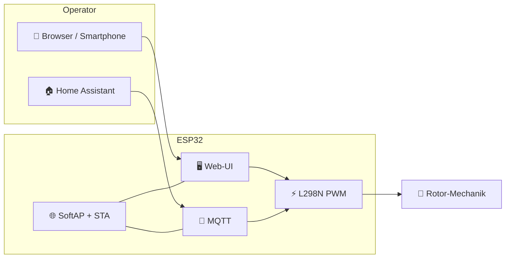

<div align="center">

# 📡 PortableRotor

### Tragbarer Antennen-Rotor — ESP32 · Web-UI · MQTT · Open Hardware

[](https://www.gnu.org/licenses/gpl-3.0)
[](https://www.espressif.com/)
[](https://www.home-assistant.io/)
[](https://hacs.xyz/)
[](https://github.com/DF3MT/DF3MT-Portable-Antenna-Wifi-Rotor/releases/latest)


| 🔩 Mechanik | 💾 Firmware | 🏠 Home Assistant | 🌐 Web |
|:---:|:---:|:---:|:---:|
| [`3D Model/`](./3D%20Model/) | [`Firmware/`](./Firmware/) | [`homeassistant/`](./homeassistant/) | [df3mt.de](https://df3mt.de) |

[✨ Funktionen](#-funktionen) · [📁 Struktur](#-repository-struktur) · [🚀 Erste Schritte](#-erste-schritte) · [⬇️ Downloads](#️-downloads--releases) · [📜 Lizenz](#-lizenz)

<!-- Anchors: GitHub strips leading emoji from heading IDs -->

</div>

---

## 🔭 Überblick

**PortableRotor** ist ein **tragbarer Antennen-Rotor** für den Amateurfunk:

- 🖨️ **3D-druckbare Mechanik**
- 🧠 Steuerung mit **ESP32**
- 📱 Bedienung im **Webbrowser**
- 🔌 optional **MQTT / Home Assistant** (+ HACS Lovelace-Card)

Dieses Repository bündelt **CAD**, **Firmware**, **HA-Integration** und Dokumentation. Die Firmware basiert auf **Arduino-ESP32** mit eingebetteter Web-UI (ohne SPIFFS).



---

## ✨ Funktionen

| | Feature | Beschreibung |
|:-:|:--|:--|
| 🖥️ | **Web-Oberfläche** | Smartphone/PC, PWM-Rampen, touchfreundlich; Motor-Sitzung pro Browser (Cookie + Header) |
| 📶 | **Netzwerk** | Parallel **SoftAP** (Einrichtung) und **STA** (Heim-WLAN); DHCP-Hostname in der Router-Liste |
| 📨 | **MQTT** | Home-Assistant-**Discovery**; Sollwert auf `{prefix}/set`, Status auf `{prefix}/state` |
| ⬆️ | **OTA** | Update per **Browser** (`.bin`) und **Arduino IDE** (Netzwerk-Port / mDNS) |
| 🛡️ | **Stabilität** | Optionales OTA-Passwort (NVS), API-Drosselung, `yield()` beim Web-Flash |
| 🧩 | **HACS-Card** | Lovelace-Karte `df3mt-rotor-card` — CW / STOP / CCW + Speed-Slider |
| 🔩 | **Mechanik** | CAD / STL im Ordner **`3D Model/`** |

---

## 📁 Repository-Struktur

```text
DF3MT-Portable-Antenna-Wifi-Rotor/
├── 📂 3D Model/                 # CAD / STL — Mechanik
├── 📂 Firmware/
│   ├── README.md                # Arduino-Kurzüberblick
│   └── DF3MT-Rotor/             # ← Sketch-Ordner (in der IDE öffnen)
│       ├── DF3MT-Rotor.ino
│       ├── DF3MT_Config.h
│       ├── kIndexHtml.h
│       └── README.md            # Build, MQTT, OTA, Sicherheit
├── 📂 homeassistant/            # MQTT-Paket, Lovelace, Card-Docs
├── 📂 docs/                     # GitHub Pages + Bilder
├── 📄 df3mt-rotor-card.js       # HACS Lovelace-Card (Root)
├── 📄 hacs.json
├── 📄 LICENSE                   # GPL-3.0
└── 📄 README.md
```

---

## 💾 Firmware

Die empfohlene Firmware (**DF3MT-Rotor**) enthält unter anderem:

- ⚡ **L298N** (oder kompatible H-Brücke) mit PWM-Rampen in der UI
- 🧭 **Captive-Portal**-Unterstützung (DNS, Konnektivitätstests)
- 🔒 **Motor-Lock:** eine Browser-Sitzung steuert den Motor; **MQTT** bleibt für Automatisierung unabhängig
- ✅ **MQTT-Validierung:** nur gültige Ganzzahlen im PWM-Bereich
- ⚙️ Zentrale Konfiguration in **`DF3MT_Config.h`**

> 📖 Ausführliche Hinweise: [`Firmware/DF3MT-Rotor/README.md`](./Firmware/DF3MT-Rotor/README.md) · [`Firmware/README.md`](./Firmware/README.md)

### 🏠 Home Assistant

| Artefakt | Pfad |
|:--|:--|
| 📦 MQTT-Paket | [`homeassistant/packages/df3mt_rotor.yaml`](./homeassistant/packages/df3mt_rotor.yaml) |
| 📊 Lovelace-Dashboard | [`homeassistant/lovelace/df3mt_rotor_dashboard.yaml`](./homeassistant/lovelace/df3mt_rotor_dashboard.yaml) |
| 🃏 HACS-Card-Doku | [`homeassistant/df3mt-rotor-card.md`](./homeassistant/df3mt-rotor-card.md) |

**Kurz-Setup:**

1. In `configuration.yaml` Packages freischalten:

```yaml
homeassistant:
  packages: !include_dir_named homeassistant/packages
```

2. `homeassistant/packages/df3mt_rotor.yaml` nach `<HA_CONFIG>/homeassistant/packages/` kopieren.
3. Home Assistant neu starten (oder Config prüfen + Neustart).
4. Dashboard: YAML aus `lovelace/df3mt_rotor_dashboard.yaml` übernehmen **oder** Cards manuell anlegen.
5. Optional: Card über **HACS** (Custom Repository → Dashboard) installieren.

> 💡 Standard-Topic-Prefix: `df3mt/rotor`. Anderen Prefix in der Rotor-Web-UI? Topics im Paket anpassen.

---

## 🚀 Erste Schritte

```text
1️⃣  Mechanik   →  Bauteile aus 3D Model/ drucken & montieren
2️⃣  Elektronik →  ESP32 + Motor-Treiber (z. B. L298N) verdrahten
3️⃣  Firmware   →  Firmware/DF3MT-Rotor/ in Arduino IDE öffnen, ESP32 + OTA-Partition, flashen
4️⃣  WLAN       →  AP „DF3MT-Rotor“ verbinden, Browser öffnen, optional Heim-WLAN eintragen
5️⃣  Pages      →  optional: GitHub Pages → Branch main, Ordner /docs
```

| Schritt | Aktion | Details |
|:-:|:--|:--|
| 1️⃣ | **Mechanik** | Modelle in [`3D Model/`](./3D%20Model/) — STL & SketchUp |
| 2️⃣ | **Elektronik** | ESP32 und L298N nach Projektunterlagen verdrahten |
| 3️⃣ | **Firmware** | Ordner `Firmware/DF3MT-Rotor/` öffnen (`DF3MT-Rotor.ino`), Board **ESP32**, Partition **mit OTA** |
| 4️⃣ | **Inbetriebnahme** | AP verbinden (z. B. `DF3MT-Rotor`), Web-UI öffnen, Heim-WLAN optional |
| 5️⃣ | **GitHub Pages** | *Settings → Pages →* Branch **main**, Ordner **`/docs`** |

---

## ⬇️ Downloads / Releases

Fertige Binaries und die Lovelace-Card liegen unter **[Releases](https://github.com/DF3MT/DF3MT-Portable-Antenna-Wifi-Rotor/releases/latest)**:

| Datei | Verwendung |
|:--|:--|
| 📦 `DF3MT-Rotor-<tag>.bin` | OTA / Web-Upload / Arduino-Netzwerk |
| 🧱 `DF3MT-Rotor-<tag>-merged.bin` | Erste USB-Flashung bei Offset `0x0` |
| 🃏 `df3mt-rotor-card.js` | HACS / manuelle Lovelace-Resource |
| 🔐 `SHA256SUMS.txt` | Prüfsummen |

---

## 🖼️ Bilder

Banner: `docs/images/hero-banner.png`. Eigene Fotos (Aufbau, UI, Platine): siehe [`docs/images/README.md`](./docs/images/README.md).

---

## 📜 Lizenz

Dieses Projekt steht unter der **GNU General Public License v3.0** — siehe [`LICENSE`](./LICENSE).

---

## 🔗 Links

| | |
|:--|:--|
| 💻 Quellcode | [github.com/DF3MT/DF3MT-Portable-Antenna-Wifi-Rotor](https://github.com/DF3MT/DF3MT-Portable-Antenna-Wifi-Rotor) |
| 🌐 Projekt | [df3mt.de](https://df3mt.de) |
| 🏷️ Releases | [Latest Release](https://github.com/DF3MT/DF3MT-Portable-Antenna-Wifi-Rotor/releases/latest) |

---

<div align="center">

### 📻 Vy 73 de · *DF3MT*

</div>
